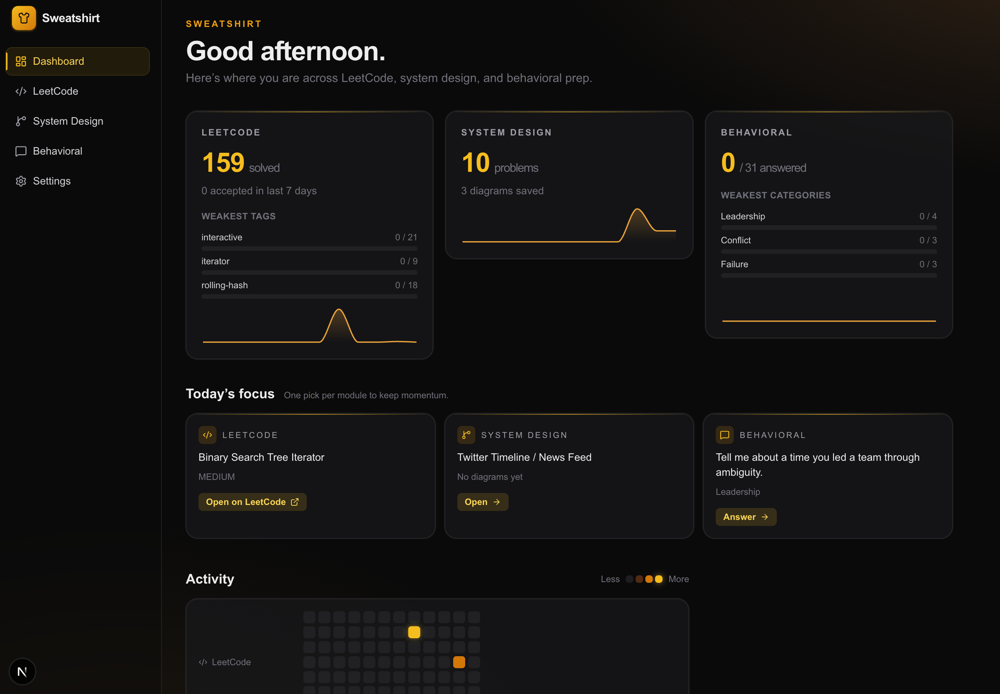

# Sweatshirt

Built for SWEs. A local web app for tracking software-engineering interview prep across three streams:

- **LeetCode** — pull your solved problems from LeetCode, see breakdowns by tag and difficulty, find the gaps you should fill next.
- **System Design** — drawable Excalidraw canvas for each classic problem, with markdown notes, multiple diagram revisions, and an **AI interviewer** (Claude) that can see your current diagram and run a back-and-forth interview about it.
- **Behavioral (STAR)** — curated question bank organized by category with a Situation / Task / Action / Result editor that autosaves.

Backed by a focused **dashboard** that surfaces today's focus (one pick per module), top weak spots per stream, a 12-week activity heatmap, and a "continue where you left off" feed.

Single-user, runs entirely on `localhost`. All data lives in a local SQLite file.



## Quick Start

```bash
npm install
npx prisma migrate dev          # creates SQLite DB + applies schema
npx prisma db seed              # seeds system-design problems + behavioral questions
npm run dev                     # http://localhost:3000
```

That's it for the system design and behavioral modules — they're usable immediately. The dashboard, the LeetCode sync, and the AI interviewer each need a small piece of one-time setup (below).

## Connecting LeetCode

LeetCode has no public API, so syncing your solved problems requires the same session cookie your browser uses.

1. Log in at [leetcode.com](https://leetcode.com).
2. Open DevTools → **Application** (Chrome) or **Storage** (Firefox) → **Cookies → https://leetcode.com**.
3. Copy the value of `LEETCODE_SESSION`.
4. In the app, open **Settings** in the sidebar (`/settings`) and paste it under the LeetCode sync section. The `csrftoken` field is optional — the library will fetch one automatically if you leave it blank.
5. Click **Sync now**. First sync takes 30–60s while it pages through the catalog; subsequent syncs are faster.

The cookie is stored in plaintext in your local SQLite database. It never leaves your machine, but anyone with access to the file effectively has access to your LeetCode account.

## Enabling the AI Interviewer

The System Design module has a Claude-backed interviewer that can see your diagram and ask probing questions. You provide your own Anthropic API key.

1. Get an API key at [console.anthropic.com](https://console.anthropic.com/settings/keys).
2. In the app, open **Settings** in the sidebar and paste it under the AI / Interviewer section. Default model is `claude-sonnet-4-6`; you can override.
3. Click **Test connection** to confirm the key works.
4. Open any system design problem and switch the left panel to the **Interviewer** tab — the model auto-greets and frames the problem. Click **Save snapshot** at any point to capture a record of the transcript + current diagram into the **History** tab.

The interviewer streams responses via SSE, sends the diagram as a PNG (via Excalidraw's `exportToBlob`) on every turn, and uses prompt caching on the system prompt so a multi-turn interview is cost-efficient. Snapshots persist across "Restart interview."

## What's in the box

| Route | Purpose |
|---|---|
| `/` | Dashboard — time-aware greeting, three summary cards with top-3 weak spots + 12-week sparklines, Today's Focus (one pick per module), three-row activity heatmap, recent activity feed |
| `/leetcode` | Sortable, filterable problem table; URL-based state; responsive Tags column |
| `/leetcode/stats` | Amber bar charts (with toggle for total available), interactive gap-analysis table (sortable, paginated, with E/M/H breakdown), suggested next problems |
| `/system-design` | List of seeded classic problems with diagram counts |
| `/system-design/[slug]` | Workspace: prompt panel + tabbed left panel (Notes / Interviewer / History) + Excalidraw canvas with multi-diagram tabs |
| `/behavioral` | Category accordion with per-category progress bars and per-question status badges (Unanswered / Drafted / Polished) |
| `/behavioral/[id]` | STAR answer editor (autosaves) |
| `/settings` | Unified settings — LeetCode sync credentials + Anthropic AI key |

## Tech Stack

Next.js 16 (App Router) · React 19 · Tailwind CSS 4 · Prisma 6 + SQLite · [`leetcode-query`](https://www.npmjs.com/package/leetcode-query) · [`@anthropic-ai/sdk`](https://www.npmjs.com/package/@anthropic-ai/sdk) · [`@excalidraw/excalidraw`](https://www.npmjs.com/package/@excalidraw/excalidraw) · [`recharts`](https://recharts.org/) · [`lucide-react`](https://lucide.dev/)

## Where Data Lives

- **Database**: `prisma/dev.db` (gitignored). Holds:
  - LeetCode catalog + your submissions + session cookie
  - System design problems, diagrams, AI conversations + messages, and snapshots
  - Behavioral categories / questions / answers
  - Anthropic API key
- **Inspect with Prisma Studio**: `npx prisma studio`
- **Reset everything**: `rm prisma/dev.db && npx prisma migrate dev && npx prisma db seed`

Both credentials (LeetCode cookie + Anthropic key) live in plaintext in this file. See [docs/architecture/credentials-and-privacy.md](docs/architecture/credentials-and-privacy.md) for the trust model.

## Useful Commands

```bash
npm run dev                     # dev server (Turbopack)
npm run build                   # production build
npm run lint                    # eslint
npx prisma studio               # GUI DB browser
npx prisma migrate dev          # apply schema changes
npx prisma db seed              # re-run seed
npx tsc --noEmit                # type-check
```

## Documentation

- **[CLAUDE.md](CLAUDE.md)** — high-level architecture and design decisions.
- **[docs/](docs/README.md)** — per-feature documentation tree. Each user-facing feature has its own doc (dashboard, LeetCode list/stats/sync, system-design workspace/interviewer/snapshots, behavioral STAR editor), plus architecture docs (data model, design system, credentials), plus a [documentation convention](docs/conventions/documentation.md) that future contributors should follow.

## Roadmap

The schema and routing leave space for these without restructuring:

- **Behavioral answer scoring** (specificity / impact / ownership / learning) via Claude.
- **Project ↔ behavioral question mapper** — over `BehavioralAnswer.projectTag` values, suggest unused questions a project could answer.
- **LeetCode "what next" agent** — replace the heuristic suggestion with a Claude-driven pick that explains its reasoning.
- **Snapshot download** — export each saved interview snapshot as `.txt` + `.png` files to local disk.
- **Encryption at rest** — passphrase-derived key for the two credential rows.

Shipped since the original plan: AI interviewer chat panel for system design, interview snapshots with read-only review, the full dashboard suite, and the amber UI refresh.